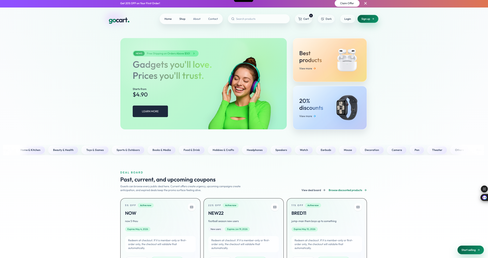
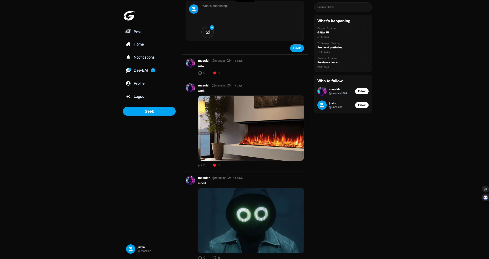
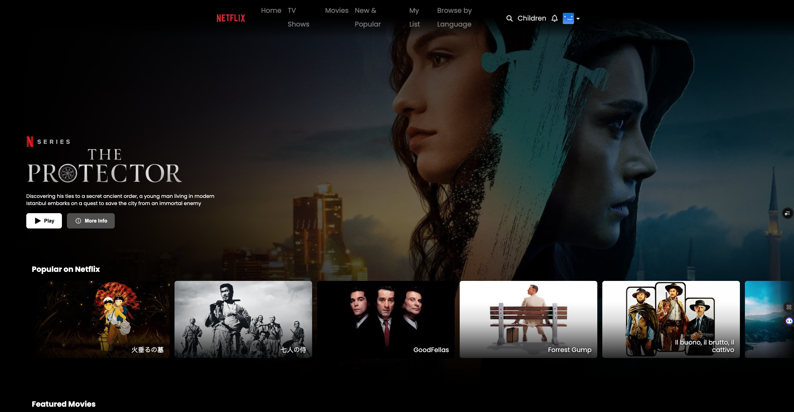

# Big Boy Portfolio

Big Boy Portfolio is the project I built to frame the rest of my work with more intention than a one-page landing screen could. I wanted the portfolio itself to prove something: not just that I can style an interface, but that I can shape presentation, route structure, case-study flow, service positioning, and contact behavior into one clean product.

This repo is the hub. It holds the strongest projects in the set, gives each one a clearer role, and turns the portfolio into more than a gallery of screenshots. The site moves from brand-led homepage to routed case studies, services, and inquiry without feeling like separate ideas stitched together.

I spent real time making the portfolio feel curated. GoCart, Glitter, Netflix Clone, and Litty Hub are not here to fill space. Each one says something different about how I build: product depth, branding, interaction, constraint-based execution, and the ability to present work in a way that makes sense to recruiters, collaborators, and clients.

## Live Site

- Live site: [big-boy-portfolio.vercel.app](https://big-boy-portfolio.vercel.app)
- Repository: [github.com/massiahtheruler/big-boy-portfolio](https://github.com/massiahtheruler/big-boy-portfolio)

## Why This Exists

I built this portfolio to do three jobs well:

- present featured work like real case studies instead of homepage thumbnails
- show that my frontend taste and product thinking belong in the same conversation
- give the site its own conversion path through services, inquiry, and contact instead of treating outreach like an afterthought

The point was never to make a portfolio that tries to be about everything at once. The point was to make one that feels selective, structured, and clear about why each project belongs.

## Core Features

- React + Vite portfolio app with React Router and a reusable routed shell
- dedicated routes for home, services, inquiry, and individual case studies
- dynamic project detail route at `projects/:slug`
- curated local content layer for case studies, services, current work, badges, and site copy
- homepage sections that separate featured work from active in-progress direction
- global contact modal with focus handling, escape support, and body locking
- dedicated inquiry page with offer-aware query params and EmailJS delivery
- theme toggle with local persistence and body-level theme state
- shared reveal system for section pacing and visual rhythm
- SCSS architecture split into base, layout, component, and page partials
- lightweight test coverage around services content and routed rendering

## Architecture Snapshot

**Frontend**
- React 19
- Vite
- React Router 7
- Sass / SCSS

**Content Layer**
- `src/data/caseStudies.js` drives featured case studies and dynamic project pages
- `src/data/currentWork.js` separates active direction from finished feature pieces
- `src/data/servicesContent.js` keeps offers, inquiry prompts, and helper copy in one place
- `src/data/siteContent.js` powers hero content, value points, stats, and shared contact info

**Interaction Layer**
- `src/App.jsx` owns the routed shell, theme state, modal state, scroll reset, and body locking
- `src/pages/ProjectPage.jsx` turns each featured build into a routed case-study view with live/code links and fallback handling
- `src/pages/InquirePage.jsx` reads the selected offer from the URL and feeds it into the inquiry flow
- `src/hooks/useTheme.js` persists theme choice and falls back to system preference on first load
- `src/components/shared/Reveal.jsx` and `src/hooks/useRevealInView.js` handle the staged section reveal behavior

## Project Preview

Until I add portfolio-specific screenshots, this section uses the featured project screens the home page leads into. Once the portfolio shots are ready, these can be replaced with captures of the portfolio itself.

### GoCart

GoCart carries the heavier product-system side of the portfolio: marketplace logic, multiple roles, checkout behavior, and a premium storefront language.



### Glitter

Glitter shows the more original social-product side: branded interaction, account-aware UI, messaging, and a stronger sense of product identity.



### Netflix Clone

Netflix Clone proves I can work inside an established product language, preserve what makes it recognizable, and still push behavior and polish further than the usual clone build.



## What I Built

### 1. A Portfolio That Behaves Like a Product

I did not want a nice-looking homepage with nowhere real to go next. The site is structured like a small product on purpose:

- a routed shell instead of a single scroll-only page
- separate views for featured work, services, and inquiry
- homepage hash navigation for the featured-work jump
- route-level scroll reset so page changes feel deliberate
- one contact system that can open from multiple entry points

That mattered because the portfolio itself is part of the proof. If I say I care about flow, clarity, and interaction, the portfolio has to show that before anyone clicks into the other repos.

### 2. Featured Work With Clear Roles

The strongest choice here was selectivity. I kept the featured set small and made each project carry a different part of the story:

- `GoCart` shows product depth, commerce behavior, and role complexity.
- `Glitter` shows branding, account-aware interaction, and social-product instincts.
- `Netflix Clone` shows restraint, polish, and the ability to work inside constraints.
- `Litty Hub`, in the current-work lane, points toward the bigger brand-system direction behind the portfolio.

That keeps the portfolio from trying to be about everything at once. The work is curated on purpose, and the case-study pages are there to explain why each piece belongs.

### 3. Services and Inquiry That Feel Built In

I wanted the site to work as a portfolio and a business tool without becoming a fake all-in-one platform.

- `ServicesPage` turns the portfolio into a clearer offer surface
- `Manifest Method` gives the services side a clearer flagship offer instead of letting it read like a generic pricing page
- supporting offers live in structured content, not scattered hardcoded sections
- `InquirePage` accepts a selected offer through the URL so the form stays contextual
- both the inquiry page and the global contact modal route through EmailJS for direct outreach

This mattered because I did not want the contact side to feel tacked on after the design was done. If the work lands, the next move should feel natural.

### 4. A Content Structure That Can Grow Without a CMS

I wanted a cleaner system for growth without pretending this project needed backend overhead it does not actually need.

- case studies, current work, services, tech badges, and shared site copy each live in their own data file
- dynamic project pages read from structured local content instead of hand-built one-off screens
- not-yet-live slugs fail gracefully instead of breaking the route
- the current-work section lets the portfolio show active direction without muddying the featured case studies

That balance was important. The portfolio can grow, but it still stays curated instead of turning into a content dump.

### 5. Theme, Motion, and Presentation With Structure Underneath

The visual direction is dark, polished, and design-led, but it is still tied to reusable behavior.

- theme state persists through `localStorage`
- the body dataset updates at the app level so the theme stays consistent across routes
- reveal wrappers control pacing across sections instead of every page improvising its own motion
- SCSS partials keep layout, component, and page styling from collapsing into one giant stylesheet

I wanted the first impression to feel sharp, but I also wanted the repo to make sense when another developer opens it.

## Technical Challenges

- Structuring the portfolio as a routed app instead of a one-off homepage without making the experience feel overbuilt for what it needed to do
- Keeping the content layer organized enough that new case studies, current-work entries, and service offers can be added cleanly without introducing CMS complexity just for appearances
- Making the homepage, project pages, services page, inquiry flow, and contact modal feel like one product instead of five disconnected screens
- Passing offer context into the inquiry route with search params so the lead flow stays specific without creating separate forms for every service
- Balancing dark premium styling, reveal timing, and motion polish with readability and restraint so the site does not tip into being overdesigned
- Coordinating body-level theme state and body locking so the theme system and the modal system do not fight each other across route changes
- Deciding what each featured project should prove, what belongs in current work instead, and how much to explain before the README starts overselling the portfolio

## Tech Stack

- React 19
- Vite
- React Router 7
- Sass / SCSS
- EmailJS
- Vitest
- Testing Library

## Project Structure

```text
src/
  components/
    home/
    layout/
    services/
    shared/
  data/
  hooks/
  pages/
  styles/
  test/
  utils/
```

- `src/pages/` contains the routed page views.
- `src/components/` holds the reusable home, layout, services, and shared presentation components.
- `src/data/` is the content system behind the portfolio.
- `src/hooks/` contains theme and reveal behavior.
- `src/styles/` keeps the SCSS architecture split by responsibility instead of piling everything into one file.

## Running Locally

```bash
npm install
npm run dev
```

Then open [http://localhost:5173](http://localhost:5173).

For a production build:

```bash
npm run build
```

Run tests:

```bash
npm run test
```

If you want the contact modal and inquiry form to send to your own inbox, update the EmailJS IDs in `src/utils/email.js`.

## Current Scope

**This portfolio is strongest right now in:**

- premium frontend presentation
- case-study framing
- service positioning
- inquiry and contact flow
- scalable local content structure

**It is not trying to be:**

- a CMS-backed portfolio platform
- a backend-heavy client portal
- a fully automated intake system

That boundary is intentional. The value here is not pretending this is a giant platform. The value is that the portfolio itself has a point of view, a structure, and a clear reason for every major piece inside it.

## Closing

Big Boy Portfolio is the project that explains the rest of the work. I built it to feel like a real presentation system, not just a page that links out to other repos. More than anything, it shows the kind of work I want to keep doing: premium frontend, sharper product framing, better storytelling, and interfaces that feel intentional all the way through.
